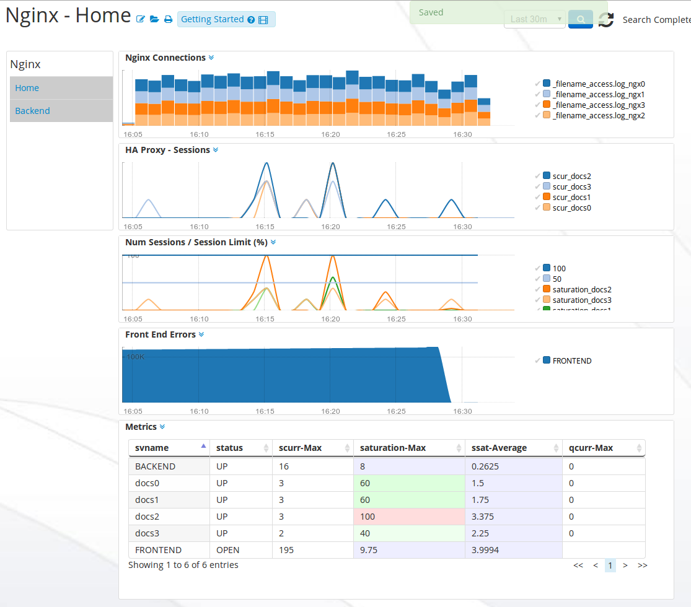
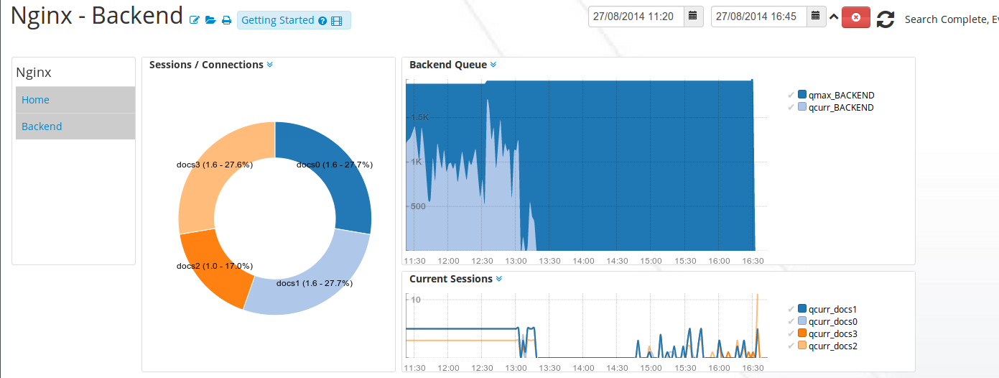

# NginxApp-1.0

# Intro 

Monitor a load balance Nginx Web Farm. This app will give overral performance metrics of HAProxy running with an Nginx backend. 

## Downloads 

 * [NginxApp-1.0.zip](https://github.com/logscape/nginxapp/raw/master/NginxApp-1.0.zip)
 * [NginxApp-1.0-override.properties](https://github.com/logscape/nginxapp/raw/master/NginxApp-1.0-override.properties) 

## Configure 

 Download the sample override file and set NGINX_HA_SOCKET to point to HAproxies admin socket. iue stats for the HAProxy are provided there. 

	NGINX_HA_SOCKET=/opt/docker/integrations/nginx/hap0/ruin/haproxy/admin.sock
	bundle.defaults.resourceSelection=hostName containsAny WebFarmAgent

## Caches 
 

## Client Requests 
 

